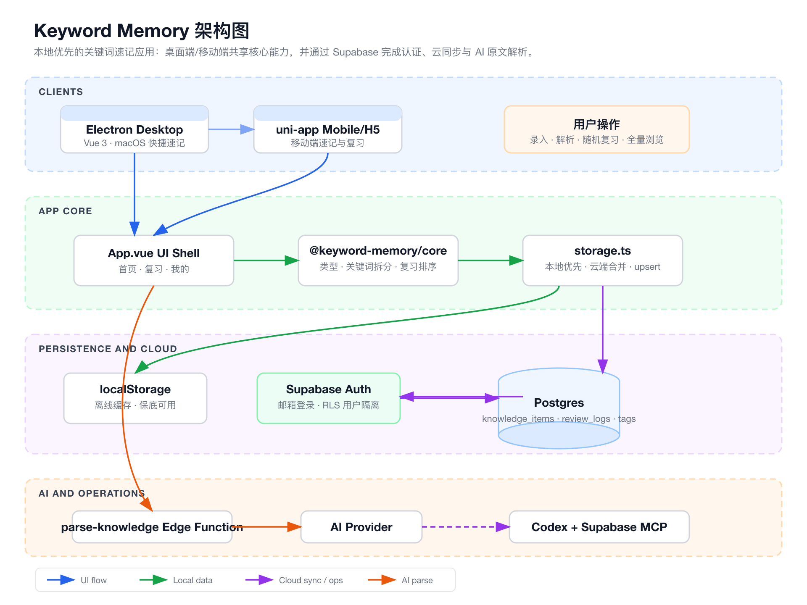
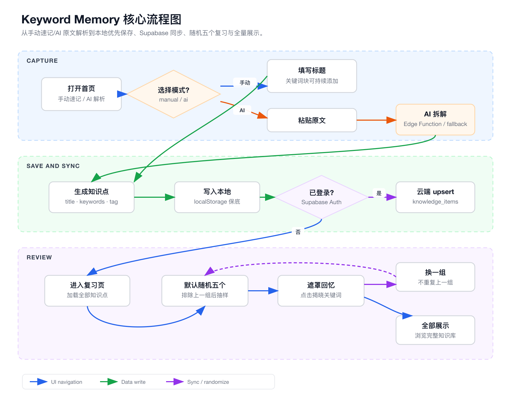

# Keyword Memory

Keyword Memory 是一个面向个人知识速记与复习的应用，核心目标是 **fast capture, keyword memory, lightweight review**。

它围绕三个动作设计：

- **快速记录 / Quick Capture**：用约 10 秒保存一个知识点。
- **关键词记忆 / Keyword Memory**：每个关键词独立成块，方便后续回忆。
- **随机复习 / Random Review**：默认随机抽取 5 个知识点，也支持全量浏览。

## 项目概览 / Overview

当前项目采用 `local-first` 的思路：桌面端可以离线使用，数据优先保存在本地；登录 Supabase 后，本地知识点会合并并同步到云端 Postgres。这样既保留了快速记录的顺滑体验，也为多端同步留下空间。

The app is built as a monorepo. Desktop and mobile clients share the same core domain package, while Supabase provides auth, cloud sync, and row-level security. AI parsing runs locally through the Electron desktop app and connects directly to an OpenAI-compatible provider.

## 系统架构 / Architecture



核心模块 / Core parts:

- `apps/desktop`：Electron + Vue 桌面端，包含首页速记、关键词块、复习抽样、Supabase 登录与同步。
- `apps/mobile`：uni-app 移动端/H5 工程，目前作为移动端速记与复习的基础骨架。
- `packages/core`：共享领域逻辑，包括类型定义、关键词解析、知识点创建、复习排序等。
- `packages/supabase`：Supabase browser client factory，用于前端连接云端服务。
- `supabase`：数据库 migrations 与可选的 `parse-knowledge` Edge Function。
- `.mcp.json`：项目级 Supabase MCP 配置，便于通过 Codex 直接操作数据库。

## 核心流程 / Core Flow



主流程分为三条路径 / Main workflow:

- **手动速记 / Manual Capture**：输入标题，一块一个关键词，可选标签和置顶，然后保存。
- **AI 解析 / AI Parsing**：粘贴原文，本地直连 AI provider 后提炼为 1 个知识点，并回填标题与关键词块。
- **复习 / Review**：从知识库加载全部知识点，默认随机展示 5 个；点击“换一组”会尽量避开上一组，点击“全部展示”可浏览完整列表。

## 目录结构 / Project Structure

```text
keyword-memory/
├── apps/
│   ├── desktop/       # Electron + Vue desktop app
│   └── mobile/        # uni-app mobile/H5 app
├── packages/
│   ├── core/          # shared types and domain helpers
│   └── supabase/      # Supabase client helper
├── supabase/
│   ├── functions/     # Edge Functions
│   └── migrations/    # database schema and RLS policies
└── docs/assets/       # architecture and flow diagrams
```

## 快速开始 / Quick Start

安装依赖并运行桌面端：

Install dependencies and start the desktop app:

```bash
npm install
npm run check
npm run dev:desktop
```

移动端 H5 开发 / Mobile H5 development:

```bash
npm run dev:mobile
```

运行完整检查 / Run checks:

```bash
npm run check
```

## 环境变量 / Environment

从示例文件创建本地环境变量文件：

Create local environment files from the examples:

```bash
cp apps/desktop/.env.example apps/desktop/.env
cp apps/mobile/.env.example apps/mobile/.env
cp supabase/functions/parse-knowledge/.env.example supabase/functions/parse-knowledge/.env
```

桌面端和移动端需要配置 Supabase 连接信息：

Desktop and mobile apps need Supabase connection values:

```bash
VITE_SUPABASE_URL=your_supabase_project_url
VITE_SUPABASE_ANON_KEY=your_supabase_publishable_or_anon_key
AI_API_KEY=your_ai_api_key
AI_API_ENDPOINT=
AI_BASE_URL=https://api.openai.com/v1
AI_MODEL=gpt-4.1-mini
```

桌面端 AI 原文解析会在本地 Electron 主进程中读取 `AI_*` 配置，并直接调用兼容 OpenAI Chat Completions 或 Responses API 的接口。

The desktop AI parser reads `AI_*` values locally and calls an OpenAI-compatible Chat Completions or Responses API endpoint directly.

## MVP 范围 / MVP Scope

- **首页 / Home**：手动速记、关键词块输入、AI 原文解析。
- **复习 / Review**：默认随机 5 条知识点，支持“换一组”和“全部展示”。
- **我的 / Mine**：标签管理、Supabase 登录、同步状态与手动同步。

## 当前状态 / Current Status

- Desktop app 已可运行，支持本地优先保存与 Supabase 云同步。
- Mobile app 已完成基础工程搭建，后续可继续补齐移动端体验。
- Database schema 已通过 Supabase migrations 管理，并启用 RLS。
- Architecture and flow diagrams are stored under `docs/assets`.
